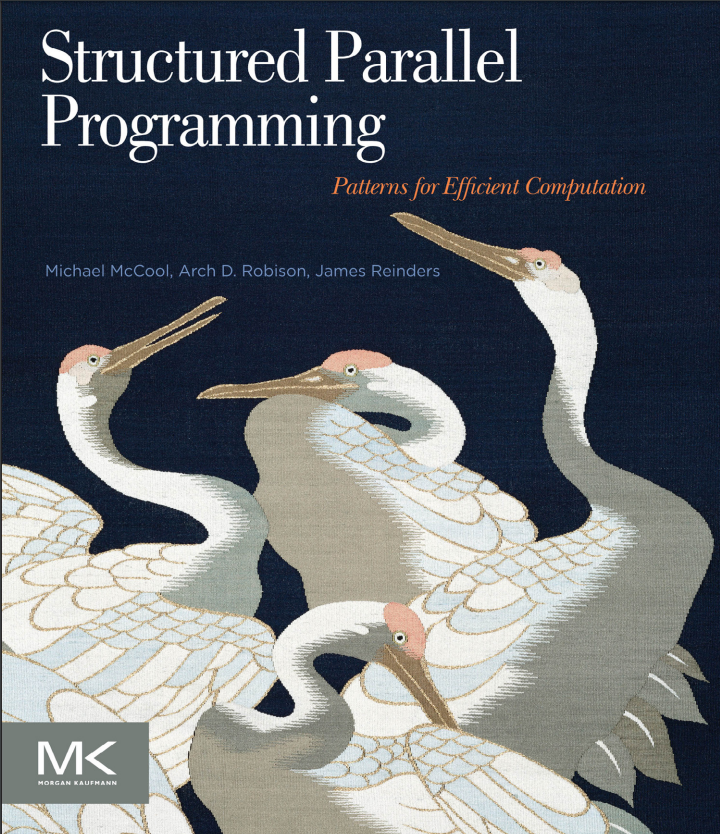

Edited by 0xDEADBEF
Thu, 29 Jun 2017 16:36:40 GMT

# 시작하며
이 글은 Structured Parallel Programming : Patterns for Efficien Computation이라는 책을 읽으면서 정리한 내용이다. 일단 딱히 계획은 없고 그냥 내키는 대로 읽고 내키는 대로 정리할 예정이다. 아 그리고 이건 영어 공부를 하는 목적이기도 하다. 그렇기에 내가 잘못 이해한 내용들도 충분히 있을 수 있으니 읽을 때 주의하기 바란다. 물론 잘못된 부분을 알게된다면 바로 고칠것이다.
아 그리고 의역이나 직역이 애매한 단어들은 각주를 달았다.
근데 유감스럽게도 github은 븅신이라 각주기능을 아직 지원안한다. 유감

이런 류의 서적들이 늘 그렇듯이 표지가 맘에 든다ㅎㅎ

자 이제 들어가기 앞서 먼저 목차부터 살펴보자.

# 목차

1. 목록
1. 서문
1. 준비 과정

## 1장. 도입부
1. 병렬 사고하기
1. 성능
1. 동기 : 만연하는 병렬성[^1]
    1. 병렬성을 조장하는 요즘 하드웨어들의 트렌드
    1. 지금껏 나온 병렬성 트렌드들
    1. 명시적 병렬 프로그래밍의 필요성
1. 구조화된 패턴 기반 프로그래밍
1. 병렬 프로그래밍 모델
    1. 원하는 성질들
    1. 작동원리 대신 추상화
    1. 일반적인 데이터 병렬성의 표현
    1. 결합성
    1. 기능 이식성[^2]
    1. 성능 이식성
    1. 안전한지, 결정론적인지 그리고 유지 가능한지
    1. 사용된 프로그래밍 모델 개요
    1. 언제 어느 모델을 사용할까?
1. 이 책의 구조
1. 요약

## 2장. 배경 지식
1. 용어와 표기법
1. 계획
1. 작동 원리
1. 기계 모델[^3]
    1. 기계 모델
    1. 성능 위한 핵심 특성
    1. Flynn의 정의
    1. 진화
1. 성능론
    1. 지연과 처리량
    1. 속도개선과 효율성 그리고 확장성
    1. 에너지
    1. Amdahl의 법칙
    1. Gustafson-Barsis의 법칙
    1. 작업-기간 모델[^4]
    1. 점근적 복잡성
    1. 점근적 속도개선과 효율성
    1. Little의 법칙
1. 실수하기 딱 좋은 것들
    1. 경쟁 조건
    1. 상호 배타와 락
    1. 교착 상태
    1. 숨막히는 크기 조정[^5]
    1. 지역의 부족[^6]
    1. 부하 불균형[^7]
    1. 오버헤드
1. 요약

___
이제 부터 **Part 1 패턴** 에 대해 배운다. 그리고 세부적인 패턴 이름은 의역이나 직역도 좀 그렇고 거의 그 패턴의 고유 명사격이므로 번역하지 않았다. 각 장에 직접 들어갈때가 되면 적당히 번역해 볼 생각이다.

## 3장. 패턴
1. 내포화 패턴[^8]
1. 구조화된 직렬 제어 흐름 패턴
    1. Sequence
    1. Selection
    1. Iteration
    1. Recursion
1. 병렬 제어 패턴
    1. Fork-Join
    1. Map
    1. Stencil
    1. Scan
    1. Recurrence
1. 직렬 데이터 관리 패턴
    1. Random Read and Write
    1. Stack Allocation
    1. Heap Allocation
    1. Closures
    1. Objects
1. 병렬 데이터 관리 패턴
    1. Pack
    1. Pipeline
    1. Geometric Decomposition
    1. Gather
    1. Scatter
1. 다른 병렬 패턴
    1. Superscalar Sequences
    1. Futures
    1. Speculative Selection
    1. Workpipe
    1. Search
    1. Segmentation
    1. Expand
    1. Category Reduction
    1. Term Graph Rewriting
1. 비결정론적인 패턴
    1. Branch and Bound
    1. Transactions
1. 패턴을 위한 프로그래밍 모델
    1. Cilk Plus
    1. Threading Building Blocks
    1. OpenMP
    1. Array Building Blocks
    1. OpenCL
1. 요약

## 4장. Map
1. Map
1. 스케일된 벡터 추가(SAXPY)
    1. 문제 설명
    1. 직렬로 구현
    1. TBB[^TBB]
    1. Cilk Plus
    1. 배열 표기법을 사용한 Cilk Plus
    1. OpenMP
    1. 벡터 연산을 사용한 ArBB[^9]
    1. 기본 함수를 사용한 ArBB
    1. OpenCL
1. 망델브로[^10]
    1. 문제 설명
    1. 직렬로 구현
    1. TBB
    1. Cilk Plus
    1. 배열 표기법을 사용한 Cilk Plus
    1. OpenMP
    1. 벡터 연산을 사용한 ArBB[^9]
    1. 기본 함수를 사용한 ArBB
    1. OpenCL
1. Sequence map *VS* Map sequence
1. 병렬 모델 비교
    1. Stencil
    1. Workpile
    1. Divide-and-conquer
1. 요약

## 5장. 공동체
1. Reduce
    1. 계산 재배치
    1. 벡터화
    1. 타일링[^tiling]
    1. 정확성
    1. 구현
1. Map과 Reduce 융합하기
    1. TBB에서의 명시적 융합
    1. Cilk Plus에서의 명시적 융합
    1. ArBB에서의 자동 융합
1. 내적[^dot_product]
    1. 문제 설명
    1. 직렬로 구현
    1. SSE Intrinsic[^sse_intrinsic]
    1. TBB
    1. Cilk Plus
    1. OpenMP
    1. ArBB
1. 스캔
    1. TBB
    1. Cilk Plus
    1. OpenMP
    1. ArBB
1. Map과 Scan 융합하기
1. 통합
    1. 문제 설명
    1. 직렬로 구현
    1. Cilk Plus
    1. OpenMP
    1. TBB
    1. ArBB
1. 요약

## 6장. 데이터 재편성
1. Gather
    1. 일반적인 Gather
    1. Shift
    1. Zip
1. Scatter
    1. 원자적 Scatter
    1. 순열 Scatter
    1. 병합 Scatter
    1. 우선순위 Scatter
1. Scatter에서 Gather로 변경하기
1. Pack
1. Map과 Gather 융합하기
1. 기하학적 분해 및 분할
1. Array Structure *VS* Structure Array
1. 요약

## 7장. Stencil 과 반복
1. Stencil
1. Shift를 사용한 Stencil 구현
1. 캐싱을 위한 Stencil 타일링
1. 통신을 위한 Stencil 최적화
1. 반복
1. 요약

## 8장. Fork-Join
1. 정의
1. Fork-Join을 위한 프로그래밍 모델
    1. Fork-Join을 위한 Cilk Plus
    1. Fork-Join을 위한 TBB
    1. Fork-Join을 위한 OpenMP
1. Map의 재귀 구현
1. 기본 케이스 선택
1. 로드 밸런싱
1. 병렬 분할 정복의 복잡성
1. 다항식의 카라추바 곱
    1. Scratch 공간 할당 시 주의 사항
1. 캐시 지역성 과 캐시-불확정 알고리즘
1. 퀵정렬
    1. Cilk 퀵정렬
    1. TBB 퀵정렬
    1. Work-Span 퀵정렬
1. Reduction과 Hyperobject
1. Fork-Join을 사용한 Scan 구현
1. 반복에 Fork-Join 적용하기
    1. 분석
    1. 균일한 Fork-Join
1. 요약

## 9장. 파이프라인
1. 기본적인 파이프라인
1. 병렬 단계를 사용한 파이프라인
1. 파이프라인 구현
1. 파이프라인을 위한 프로그래밍 모델
    1. TBB에서의 파이프라인
    1. Cilk Plus에서의 파이프라인
1. 더 일반적인 토폴로지[^topology]
1. 필수적인 *VS* 선택적인 병렬성
1. 요약
___

이제부터는 **Part 2 예제** 들이 나온다.

## 10장. 전방 지진 시뮬레이션[^forward_seismic]
1. 배경 지식
1. Stencil 계산
1. 산술 강도에서의 캐시의 위력
1. 공간-시간 타일링을 사용한 산술 강도 상승
1. Cilk Plus 코드
1. ArBB 구현
1. 요약

## 11장. K-Means 클러스터링
1. 알고리즘
1. Cilk Plus를 사용한 K-Means
    1. Hyperobject
1. TBB를 사용한 K-Means
1. 요약

## 12장. Bzip2 데이터 압축
1. Bzip2 알고리즘
1. TBB를 사용한 3단계 파이프라인
1. TBB를 사용한 4단계 파이프라인
1. Cilk Plus를 사용한 3단계 파이프라인
1. 요약

## 13장. 병합 정렬
1. 병렬 병합[^parallel_merge]
    1. TBB 병렬 병합
    1. 병렬 병합의 Work-Span
1. 병렬 병합 정렬
    1. 병합 정렬의 Work-Span
1. 요약

## 14장. 예제 정렬
1. 전체 구조
1. 쓰레기통 개수 고르기
1. 버리기
    1. TBB로 구현
1. 재포장과 준정렬[^repacking_subsorting]
1. 예제 정렬의 성능 분석
1. C++ 전문가를 위한 장
1. 요약

## 15장. 콜레스키 분해
1. 포트란 규칙!
1. 재귀 콜레스키 분해
1. Triangular 풀이
1. 대칭 순위 업데이트
1. 어디서 시간을 잡아먹나?
1. 요약
___

다음은 **부록** 이다.

## 부록 A. 추가적으로 읽어볼 것
1. 병렬 알고리즘과 패턴들
1. 병렬 시스템을 포함하는 컴퓨터 아키텍처
1. 병렬 프로그래밍 모델

## 부록 B. Cilk Plus
1. TBB에서의 공유 디자인 원칙
1. 유일무이한 특성
1. TBB에서 요소 빌리기
1. 키워드 스펠링[^spelling]
1. cilk_for
1. cilk_spawn과 cilk_sync
1. Reducers(Hyperobject)
    1. C++ 문법
    1. C 문법
1. 배열 표기법
    1. 배열 부분 명시
    1. 배열 부분 작업
    1. 배열 부분 축소
    1. 묵시적 인덱스
    1. 배열 부분의 부분 중복 피하기
1. #pragma simd
1. 기본 함수들
    1. 속성 문법
1. C++11 주의점
1. 설치 시 주의점
1. 역사
1. 요약

## 부록 C. TBB
1. 유일무이한 특성
1. TBB 사용하기
1. parallel_for
    1. blocked_range
    1. Partinioner
1. parall_reduce
1. parallel_deterministic_reduce
1. parallel_pipeline
1. parallel_invoke
1. task_group
1. task
    1. empty_task
1. atomic
1. enumerable_thread_specific
1. C++11 주의점
1. 역사
1. 요약

## 부록 D. C++11
1. auto 정의
1. 람다 표현식
1. std::move

## 부록 E. 용어 사전
___
목차는 위와 같다. 참고로 참고문헌이랑 색인은 생략했다. 다음으로 목록을 보자.

# 목록
1. _
   1. 묵시적 직렬 배치를 사용한 두 벡터 더하기
   1. C에서의 중복된 인자들
   1. Cilk Plus 배열 표기법을 사용한 두 벡터 더하기
   1. C에서의 정렬된 합이 만드는 의존
   1. Cilk Plus에서의 병렬 합
   1. C에서의 명시적 순차 배치를 사용한 함수 호출
   1. Cilk Plus에서의 배치가 필요없는 함수 호출
   1. C에서 루프로 구현하는 직렬 벡터 합 코드
   1. Cilk Plus를 사용한 병렬 벡터 합
   1. ArBB를 사용한 병렬 벡터 합
   1. C에서의 스칼라 함수
   1. Cilk Plus에서의 합을 위한 벡터화된 함수
   1. C에서의 직렬 피보나치 계산
   1. 병렬 Cilk Plus를 사용한 1.13
   1. ArBB 에서의 벡터 계산
   1. ArBB 에서의 기본적인 함수 계산
1. _
1. _
   1. 직렬 시퀀스 의사코드
   1. 직렬 시퀀스 의사코드 두번째 예제
   1. 직렬 셀렉션 의사코드
   1. while문을 사용한 반복 의사코드
   1. for문을 사용한 반복 의사코드
   1. while/for 등가 증명 의사코드
   1. C에서 어려운 예제
   1. C에서 또다른 어려운 예제
   1. Reduction 직렬 구현
   1. Scan 직렬 구현
   1. Superscalar 시퀀스 의사코드
1. _
   1. C에서 SAXPY 직렬 구현
   1. TBB에서 SAXPY 타일 구현
   1. cilk_for를 사용한 Cilk Plus 에서의 SAXPY
   1. cilk_for를 사용한 Cilk Plus 에서의 SAXPY와 명시적 벡터화를 위한 배열 표기법
   1. OpenMP에서의 SAXPY
   1. 벡터 표현식을 사용한 ArBB에서의 SAXPY
   1. 벡터 표현식 구현을 위해 바인딩 코드를 사용한 ArBB에서의 SAXPY
   1. 기본 함수를 사용한 ArBB에서의 SAXPY
   1. 호출 작업을 사용한 ArBB에서의 SAXPY
   1. OpenCL 커널 언어에서의 SAXPY
   1. C에서의 망델브로 직렬 구현
   1. TBB에서의 망델브로 타일 구현
   1. Cilk Plus에서 cilk_for를 사용한 망델브로
   1. 명시적 벡터화를 위한 cilk_for과 배열 표기법을 사용한 Cilk Plus에서의 망델브로
   1. OpenMP에서의 망델브로
   1. ArBB map 작업을 위한 망델브로 기본 함수
   1. ArBB 구현을 위한 망델브로 호출 코드
   1. ArBB 구현을 위한 망델브로 바인딩 코드
   1. OpenCL 구현을 위한 망델브로 커널 코드
1. _
   1. 0개 또는 그 이상의 요소를 위한 C++ 직렬 축소
   1. 1개 또는 그 이상의 요소를 위한 C++ 직렬 축소
   1. C++에서 내적 직렬 구현
   1. SSE Intrinsic을 사용한 벡터화된 내적 구현
   1. TBB에서의 내적 구현
   1. 배정밀도 작업을 사용한 5.5 수정
   1. Cilk Plus 배열 표기법에서의 내적 구현
   1. 명시적 타일링을 사용한 Cilk Plus에서의 내적 구현
   1. 곱셈과 합을 위한 배정밀도 작업을 사용한 5.8 수정
   1. OpenMP에서의 내적 구현
   1. ArBB에서의 내적 구현
   1. ArBB에서의 내적 구현 래퍼 코드
   1. ArBB에서의 고정밀도 내적
   1. C++에서의 포괄적 스캔 직렬 구현
   1. C++에서의 배타적 스캔 직렬 구현
   1. OpenMP에서의 3단계 타일링 스캔 구현
   1. C++에서의 직렬 통합 표 준비
   1. 통합을 위한 제네릭 테스트 함수
   1. 통합을 위한 테스트 함수의 구체적 인스턴스 실체화
   1. C++에서의 통합 룩업-테이블 직렬 구현
   1. Cilk Plus에서의 통합된 테이블 준비
   1. TBB에서의 통합된 테이블 준비
   1. ArBB에서의 통합된 테이블 준비
   1. AtBB에서의 통합된 룩업-테이블
1. _
   1. Gather 직렬 구현 의사코드
   1. Scatter 직렬 구현 의사코드
   1. Structure 배열(AoS) 데이터 구조
   1. 배열 Structure(SoA) 데이터 구조
1. _
   1. Stencil 직렬 구현
   1. 직렬 2D 반복
1. _
   1. Cilk Plus에서의 map 패턴 재귀 구현
   1. goto로 꼬리 호출을 사용한 8.1 수정
   1. Cilk Plus에서의 정리된 반-재귀 맵
   1. steal-continuation *VS* steal-child 를 보여주는 세 개의 반복문 형태
   1. Cilk Plus 배열 표기법을 사용한 다항식 곱의 균일 알고리즘
   1. Cilk Plus에서의 카라추바 곱
   1. 스크래치 공간의 타입
   1. 재귀 행렬 곱 의사코드
   1. 퀵정렬 구현에 의한 코드 공유
   1. Clik Plus를 사용한 완전-재귀 병렬화 퀵정렬
   1. Clik Plus를 사용한 반-재귀 병렬화 퀵정렬
   1. TBB를 사용한 반-반복  병렬화 퀵정렬
   1. Cilk Plus 공간을 보장하는 TBB에서의 퀵정렬
   1. Cilk Plus에서의 병렬 축소의 재귀적 구현
   1. Cilk Plus에서의 Hyperobject 사용을 통한 경쟁 회피
   1. Cilk Plus에서 지역 Reducer 사용
   1. 타일 병렬 스캔을 위한 최고의 코드
   1. Cilk Plus에서의 타일 병렬 스캔을 위한 활성화 단계
   1. Cilk Plus에서의 타일 병렬 스캔을 위한 비활성화 단계
   1. 8.17에서 cilk_scan을 사용한 pack 패턴 구현
   1. 격자점의 마름모꼴 계산 위한 기본 케이스
   1. Cilk Plus에서 이항 격자의 병렬 재귀 계산 위한 코드
   1. Cilk Plus에서의 마름모꼴 행진
1. _
   1. 파이프라인의 직렬 구현
   1. TBB에서의 파이프라인
   1. Cilk Plus의 파이프라인은 9.1의 직렬 파이프라인과 같다
   1. CIlk Plus의 직렬 아이템 소비를 위한 Reducer 정의
1. _
   1. 산란장 시뮬레이션을 위한 직렬 코드
   1. 1차원 반복 Stencil을 위한 코드
   1. 공간-시간 부등변사각형에 Stencil을 적용하기 위한 기본 사례
   1. Cilk Plus에서의 병렬 캐시-불확정
   1. 산란장 시뮬레이션을 위한 ArBB 코드
1. _
   1. Cilk Plus에서의 K-Means
   1. sum_and_count로 클러스터 점들의 평균 계산
   1. Cilk Plus에서의 배열 elementwise 합산을 위한 Hyperobject 정의
   1. TBB에서의 Thread-local 뷰를 위한 tls_type 정의
   1. local 뷰 탐색을 통한 변화 감지
   1. local 뷰 탐색을 통한 전체 합산
   1. 주어진 점에서 가장 가까운 중심 인덱스를 찾기 위한 루틴
   1. TBB에서의 K-Means 클러스터링
1. _
   1. bzip2 파이프라인 정의
   1. TBB parallel_pipeline을 사용한 bzip2 작업 조직화
   1. consumer reducer를 사용한 Cilk Plus에서의 bzip2 파이프라인 스케치
1. _
   1. 직렬 병합
   1. Cilk Plus에서의 병렬 병합
   1. Cilk Plus에서의 병렬 병합에서 TBB로 변환
   1. Cilk Plus에서의 병렬 병합 정렬
1. _
   1. 병렬 예제 정렬을 위한 최고의 코드
   1. 쓰레기통 키 매핑을 위한 코드
   1. Cilk Plus를 사용한 병렬 키 제거
   1. Cilk Plus를 사용한 재포장과 준정렬
   1. 명시적인 루프없이 Cilk Plus를 사용한 시퀀스 이동과 제거!
1. _
   1. 재귀적 콜레스키 분해법
   1. Cilk Plus에서의 병렬 Triangular 풀이
   1. Cilk Plus에서의 병렬 대칭 순위 업데이트
   1. Cilk Plus에서의 병렬 대칭 순위 업데이트에서 TBB로 변환

___
와.. 이제 드디어 목차&목록이 끝났다; 다음에 비로소 서문이 나온다.목차를 읽다가 알 수 있었을 것이다. 그렇다. 하나하나 친절한 번역을 하기엔 시간이 없다. 차피 나만 볼건데 뭐

그래서 앞으로는 각주가 크게 줄 것이다. 하.. 진짜 글 겁나 많아;

[^1]:Pervasive Parallelism / IT 용어 대사전에서는 병행성으로 나오는데 Parallel이 병렬이고 Concurrent가 병행인점으로 미루어 병렬성으로 의역.  
[^2]:Portability of Functionality / 헿. 어케 번역할지 모르겟따  
[^3]:Machine Model / 기계 모델? 검색해도 따로 안나와서 직역.  
[^4]:Work-Span / 따로 있는 말은 아니고 병렬 프로그래밍에서만 나오는듯  
[^5]:Strangled Scaling / 걍 크기 조정하다 터진듯;  
[^6]:Lack of Locality / ㅇㅅㅇ  
[^7]:Load Imbalance  
[^8]:Nesting Pattern / 민중판 이공학 표준영어사전에서 찾은건데 전산학 용어는 입에 착착 안붙음;  
[^9]:Intel Array Building Blocks의 줄임말이라고 한다.  
[^10]:Mandelbrot / 거 왜 수학에서 망델브로 집합 하는거 있잖음 그거  
[^TBB]: Thread Building Blocks의 줄임말이라고 한다.  / C++ 라이브러리 같은건데 자세한건 그때가서 ㄱㄱ  
[^dot_product]: Dot product / 수학에서의 내적.  
[^sse_intrinsic]: [여길 보시라](https://msdn.microsoft.com/en-us/library/y0dh78ez\(v=vs.71\).aspx)  
[^tiling]: Tiling  
[^topology]: Topology / 위상 수학? 뭐지 이건; 왜 갑자기 수학 용어가..  
[^forward_seismic]: Forward Seismic  
[^parallel_merge]: Parallel Merge / 병렬, 병합, 병행 말이 햇갈릴 수 있으나 엄연히 다른 단어들이다. 햇갈린다면 사전 ㄱㄱ  
[^repacking_subsorting]: repacking_subsorting  
[^spelling]: Spelling / 맞춤법, 주문, 차례.. 의역과 직역 둘 다 애매해서 발음을 적었다.  
