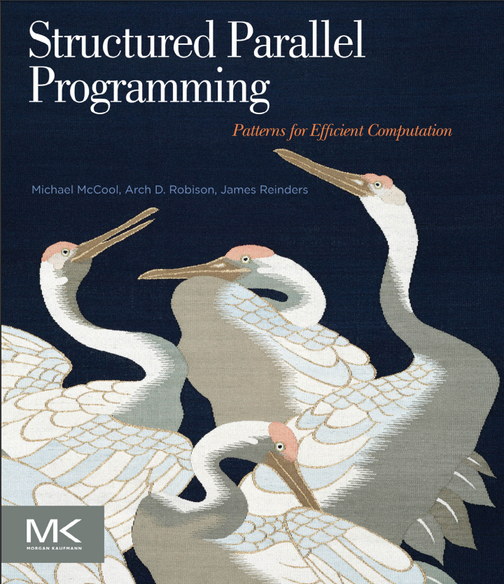

Edited by 0xDEADBEF
Thu, 29 Jun 2017 16:36:40 GMT

# 시작하며
이 글은 Structured Parallel Programming : Patterns for Efficien Computation이라는 책을 읽으면서 정리한 내용이다. 일단 딱히 계획은 없고 그냥 내키는 대로 읽고 내키는 대로 정리할 예정이다. 아 그리고 이건 영어 공부를 하는 목적이기도 하다. 그렇기에 내가 잘못 이해한 내용들도 충분히 있을 수 있으니 읽을 때 주의하기 바란다. 물론 잘못된 부분을 알게된다면 바로 고칠것이다.
아 그리고 의역이나 직역이 애매한 단어들은 각주를 달았다.

이런 류의 서적들이 늘 그렇듯이 표지가 맘에 든다ㅎㅎ

자 이제 들어가기 앞서 먼저 목차부터 살펴보자.

# 목차

0. 목록
0. 서문
0. 준비 과정

## 1장. 도입부
0. 병렬 사고하기
0. 퍼포먼스
0. 동기 : 만연하는 병렬성[^1]
    0. 병렬성을 조장하는 요즘 하드웨어들의 트렌드
    0. 지금껏 나온 병렬성 트렌드들
    0. 명시적 병렬 프로그래밍의 필요성
0. 구조화된 패턴 기반 프로그래밍
0. 병렬 프로그래밍 모델
    0. 원하는 성질들
    0. 작동원리 대신 추상화
    0. 일반적인 데이터 병렬성의 표현
    0. 결합성
    0. 기능 이식성[^2]
    0. 퍼포먼스 이식성
    0. 안전한지, 결정론적인지 그리고 유지 가능한지
    0. 사용된 프로그래밍 모델 개요
    0. 언제 어느 모델을 사용할까?
0. 이 책의 구조
0. 요약

## 2장. 배경 지식
0. 용어와 표기법
0. 계획
0. 작동 원리
0. 기계 모델[^3]
    0. 기계 모델
    0. 퍼포먼스를 위한 핵심 특성
    0. Flynn의 정의
    0. 진화
0. 성능론
    0. 지연과 처리량
    0. 속도개선과 효율성 그리고 확장성
    0. 에너지
    0. Amdahl의 법칙
    0. Gustafson-Barsis의 법칙
    0. 작업-기간 모델[^4]
    0. 점근적 복잡성
    0. 점근적 속도개선과 효율성
    0. Little의 법칙
0. 실수하기 딱 좋은 것들
    0. 경쟁 조건
    0. 상호 배타와 락
    0. 교착 상태
    0. 숨막히는 크기 조정[^5]
    0. 지역의 부족[^6]
    0. 부하 불균형[^7]
    0. 오버헤드
0. 요약

___
이제 부터 **Part 1 패턴** 에 대해 배운다. 그리고 세부적인 패턴 이름은 의역이나 직역도 좀 그렇고 거의 그 패턴의 고유 명사격이므로 번역하지 않았다. 각 장에 직접 들어갈때가 되면 적당히 번역해 볼 생각이다.

## 3장. 패턴
0. 내포화 패턴[^8]
0. 구조화된 직렬 제어 흐름 패턴
    0. Sequence
    0. Selection
    0. Iteration
    0. Recursion
0. 병렬 제어 패턴
    0. Fork-Join
    0. Map
    0. Stencil
    0. Scan
    0. Recurrence
0. 직렬 데이터 관리 패턴
    0. Random Read and Write
    0. Stack Allocation
    0. Heap Allocation
    0. Closures
    0. Objects
0. 병렬 데이터 관리 패턴
    0. Pack
    0. Pipeline
    0. Geometric Decomposition
    0. Gather
    0. Scatter
0. 다른 병렬 패턴
    0. Superscalar Sequences
    0. Futures
    0. Speculative Selection
    0. Workpipe
    0. Search
    0. Segmentation
    0. Expand
    0. Category Reduction
    0. Term Graph Rewriting
0. 비결정론적인 패턴
    0. Branch and Bound
    0. Transactions
0. 패턴을 위한 프로그래밍 모델
    0. Cilk Plus
    0. Threading Building Blocks
    0. OpenMP
    0. Array Building Blocks
    0. OpenCL
0. 요약

## 4장. Map
0. Map
0. 스케일된 벡터 추가(SAXPY)
    0. 문제 설명
    0. 직렬로 구현
    0. TBB[^TBB]
    0. Cilk Plus
    0. 배열 표기법을 사용한 Cilk Plus
    0. OpenMP
    0. 벡터 연산을 사용한 ArBB[^9]
    0. 기본 함수를 사용한 ArBB
    0. OpenCL
0. 망델브로[^10]
    0. 문제 설명
    0. 직렬로 구현
    0. TBB
    0. Cilk Plus
    0. 배열 표기법을 사용한 Cilk Plus
    0. OpenMP
    0. 벡터 연산을 사용한 ArBB[^9]
    0. 기본 함수를 사용한 ArBB
    0. OpenCL
0. Sequence map *VS* Map sequence
0. 병렬 모델 비교
    0. Stencil
    0. Workpile
    0. Divide-and-conquer
0. 요약

## 5장. 공동체
0. Reduce
    0. 계산 재배치
    0. 벡터화
    0. 타일링[^tiling]
    0. 정확성
    0. 구현
0. Map과 Reduce 융합하기
    0. TBB에서의 명시적 융합
    0. Cilk Plus에서의 명시적 융합
    0. ArBB에서의 자동 융합
0. 내적[^dot_product]
    0. 문제 설명
    0. 직렬로 구현
    0. SSE Intrinsic[^sse_intrinsic]
    0. TBB
    0. Cilk Plus
    0. OpenMP
    0. ArBB
0. 스캔
    0. TBB
    0. Cilk Plus
    0. OpenMP
    0. ArBB
0. Map과 Scan 융합하기
0. 통합
    0. 문제 설명
    0. 직렬로 구현
    0. Cilk Plus
    0. OpenMP
    0. TBB
    0. ArBB
0. 요약

## 6장. 데이터 재편성
0. Gather
    0. 일반적인 Gather
    0. Shift
    0. Zip
0. Scatter
    0. 원자적 Scatter
    0. 순열 Scatter
    0. 병합 Scatter
    0. 우선순위 Scatter
0. Scatter에서 Gather로 변경하기
0. Pack
0. Map과 Gather 융합하기
0. 기하학적 분해 및 분할
0. Array Structure *VS* Structure Array
0. 요약

## 7장. Stencil 과 반복
0. Stencil
0. Shift를 사용한 Stencil 구현
0. 캐싱을 위한 Stencil 타일링
0. 통신을 위한 Stencil 최적화
0. 반복
0. 요약

## 8장. Fork-Join
0. 정의
0. Fork-Join을 위한 프로그래밍 모델
    0. Fork-Join을 위한 Cilk Plus
    0. Fork-Join을 위한 TBB
    0. Fork-Join을 위한 OpenMP
0. Map의 재귀 구현
0. 기본 케이스 선택
0. 로드 밸런싱
0. 병렬 분할 정복의 복잡성
0. 다항식의 카라추바 곱
    0. Scratch 공간 할당 시 주의 사항
0. 캐시 지역성 과 캐시-불확정 알고리즘
0. 퀵정렬
    0. Cilk 퀵정렬
    0. TBB 퀵정렬
    0. Work-Span 퀵정렬
0. Reduction과 Hyperobject
0. Fork-Join을 사용한 Scan 구현
0. 반복에 Fork-Join 적용하기
    0. 분석
    0. 균일한 Fork-Join
0. 요약

## 9장. 파이프라인
0. 기본적인 파이프라인
0. 병렬 단계를 사용한 파이프라인
0. 파이프라인 구현
0. 파이프라인을 위한 프로그래밍 모델
    0. TBB에서의 파이프라인
    0. Cilk Plus에서의 파이프라인
0. 더 일반적인 토폴로지[^topology]
0. 필수적인 *VS* 선택적인 병렬성
0. 요약
___

이제부터는 **Part 2 예제** 들이 나온다.

## 10장. 전방 지진 시뮬레이션[^forward_seismic]
0.

[^1]:Pervasive Parallelism / IT 용어 대사전에서는 병행성으로 나오는데 Parallel이 병렬이고 Concurrent가 병행인점으로 미루어 병렬성으로 의역.  
[^2]:Portability of Functionality / 헿. 어케 번역할지 모르겟따  
[^3]:Machine Model / 기계 모델? 검색해도 따로 안나와서 직역.  
[^4]:Work-Span / 따로 있는 말은 아니고 병렬 프로그래밍에서만 나오는듯  
[^5]:Strangled Scaling / 걍 크기 조정하다 터진듯;  
[^6]:Lack of Locality / ㅇㅅㅇ  
[^7]:Load Imbalance  
[^8]:Nesting Pattern / 민중판 이공학 표준영어사전에서 찾은건데 전산학 용어는 입에 착착 안붙음;  
[^9]:Intel Array Building Blocks의 줄임말이라고 한다.  
[^10]:Mandelbrot / 거 왜 수학에서 망델브로 집합 하는거 있잖음 그거  
[^TBB]: Thread Building Blocks의 줄임말이라고 한다.  / C++ 라이브러리 같은건데 자세한건 그때가서 ㄱㄱ  
[^dot_product]: Dot product / 수학에서의 내적.  
[^sse_intrinsic]: [여길 보시라](https://msdn.microsoft.com/en-us/library/y0dh78ez\(v=vs.71\).aspx)  
[^tiling]: Tiling  
[^topology]: Topology / 위상 수학? 뭐지 이건; 왜 갑자기 수학 용어가..  
[^forward_seismic]: Forward Seismic  
