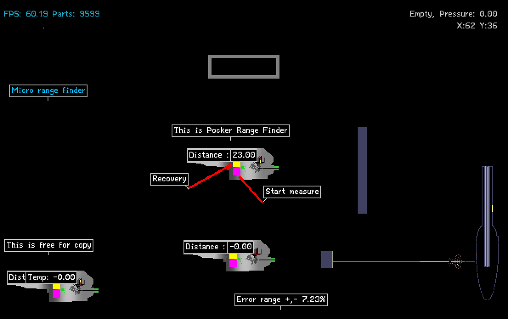
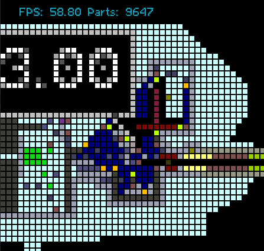

Edited by 0xDEADBEF
Tue, 27 Jun 2017 13:47:09 GMT
# Laser range finder

## Description

This device can measure distance with decimal.

- Pink button   : Start measure
- Yellow button :  Recovery (If PHOT can't come back)

## Mechanism

SPRK heat METL consistently. And PHOT speed is also consistent too. When pink button activated, then PCLN generates PHOT and cool them by PSCN-SPRK by BTRY and slow down them for accuracy. So while PHOT is in outside, SPRK starts heating METL. Therefore METL temperature increases in proportion to the time during PHOT is in outside.

`id : 2149464`
